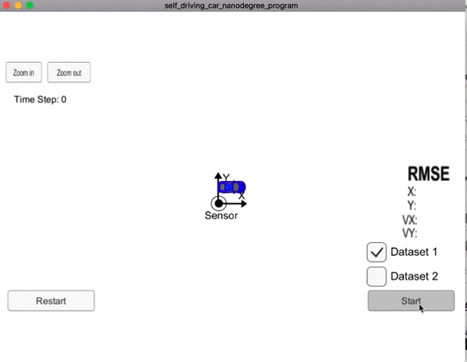

# Submassion on Extended Kalman Filter Project 

The goals of this project are the following:

- Implement the extended Kalman filter based lidar & radar sensor fusion algorithm
- Achieve the desired precision on the given test dataset

### all the code about the EKF is in the ./src

## my demo

### Tracking Accuracy

------

Algorithm performance on dataset 1 & 2 are as follows:

| Dataset  | RMSE[px, py, vx, vy]             |
| -------- | -------------------------------- |
| Dataset1 | [0.0973, 0.0855, 0.4513, 0.4399] |
| Dataset2 | [0.0726, 0.0965, 0.4216, 0.4932] |

Which meets the required accuracy.

